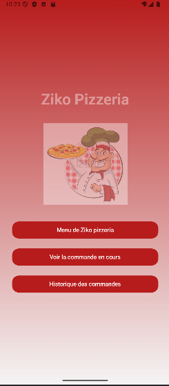
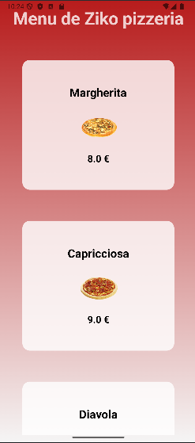
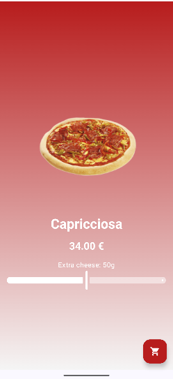
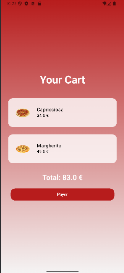
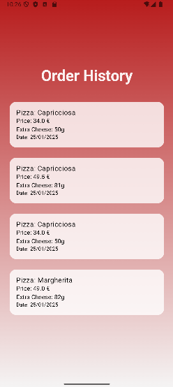

# 🍕 PizzApp 🍕

Welcome to **PizzApp**, the ultimate pizza ordering application! This project is designed to provide a seamless and delightful experience for users to browse, customize, and order their favorite pizzas. The app is built using modern Android development practices with Jetpack Compose, Kotlin, and Room for local database management.

## ✨ Features ✨

- **🎉 Welcome Screen**: A visually appealing welcome screen with animated transitions and gradient backgrounds.
- **📜 Pizza Menu**: Browse through a list of delicious pizzas with detailed descriptions and images.
- **🧀 Pizza Customization**: Customize your pizza with extra cheese and see the updated price in real-time.
- **🛒 Cart Management**: Add pizzas to your cart and view the total price.
- **📜 Order History**: Keep track of your past orders with detailed information.

## 📸 Screenshots







## 🎥 Video

[![Watch the video]https://drive.google.com/file/d/1vecHYI5RiJmmbP1FUiMPt54BKpdef5q3/view?usp=sharing

## 🚀 Getting Started

### Prerequisites

- 🛠️ Android Studio 2024.2.1 Patch 2 or later
- 🛠️ Kotlin 1.8.0 or later
- 🛠️ Gradle 7.0 or later

### Installation

1. Clone the repository:
    ```sh
    git clone https://github.com/HASSADZAKARIA/PizzApp.git
    ```
2. Open the project in Android Studio.
3. Sync the project with Gradle files.
4. Run the app on an emulator or physical device.

## 🗂️ Project Structure

- `app/src/main/java/fr/unica/miage/hassad/pizzapp/`: Main application package.
  - `model/`: Contains data models such as `Pizza` and `Order`.
  - `screens/`: Contains composable functions for different screens like `WelcomeScreen`, `PizzaMenu`, `PizzaDetail`, `CartScreen`, and `OrderHistoryScreen`.
  - `viewmodel/`: Contains ViewModel classes for managing UI-related data.
  - `data/`: Contains Room database setup and DAO interfaces.

## 🔑 Key Components

### 🎨 WelcomeScreen

A visually stunning welcome screen with animated transitions and gradient backgrounds to captivate users from the start.

### 🍕 PizzaMenu

Displays a list of available pizzas with images and prices. Users can click on a pizza to view more details and customize their order.

### 🧀 PizzaDetail

Allows users to customize their pizza with extra cheese and see the updated price in real-time. Users can add the customized pizza to their cart.

### 🛒 CartScreen

Shows the list of pizzas added to the cart along with the total price. Users can proceed to checkout from here.

### 📜 OrderHistoryScreen

Displays a list of past orders with detailed information including the pizza name, price, extra cheese, and order date.

## 🤝 Contributing

Contributions are welcome! Please follow these steps to contribute:

1. Fork the repository.
2. Create a new branch (`git checkout -b feature/your-feature`).
3. Commit your changes (`git commit -m 'Add some feature'`).
4. Push to the branch (`git push origin feature/your-feature`).
5. Open a pull request.

## 📄 License

This project is licensed under the MIT License. See the `LICENSE` file for more details.

## 🙏 Acknowledgements

- Thanks to the Android community for their valuable resources and tutorials.
- Special thanks to the contributors who helped make this project better.

---

Enjoy your pizza ordering experience with **PizzApp**! 🍕🍕🍕
